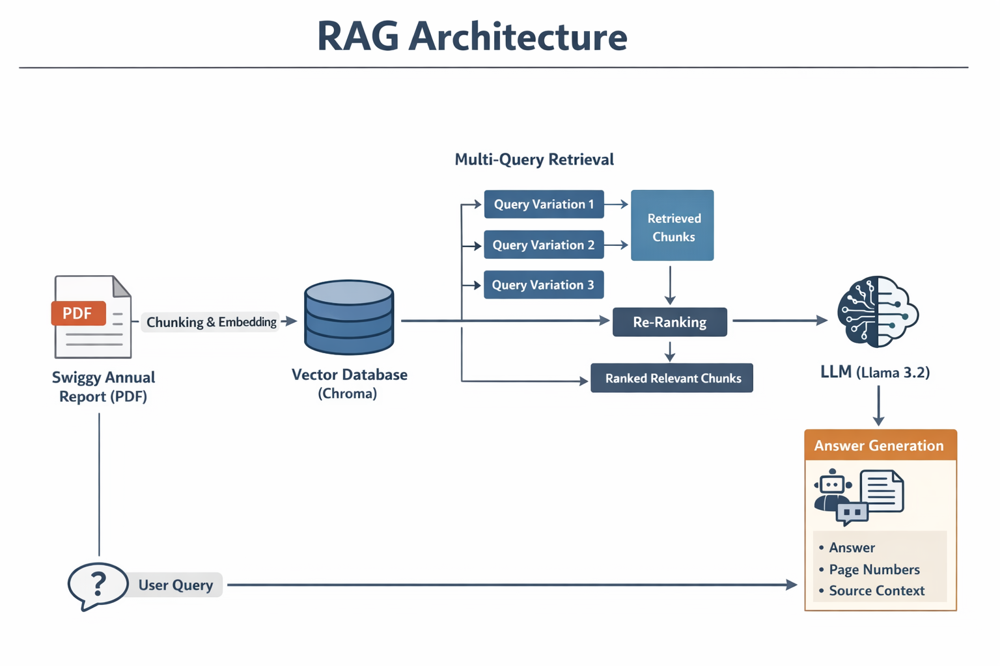

# Swiggy Intelligence Bot 
### AI-Powered Annual Report Analysis System

This repository contains a **Retrieval-Augmented Generation (RAG)** application designed to analyze and answer queries based on the **Swiggy Annual Report 2023-24**. Developed as a technical assignment for the **Newel Technology** ML Intern recruitment.

---

## 🎯 Project Objective
The goal is to create a specialized QA system that eliminates LLM hallucinations by forcing the model to retrieve facts directly from Swiggy's official financial disclosures. 




## 🛠️ Tech Stack
* **LLM:** Llama-3.2-3B-Instruct (via Hugging Face)
* **Orchestration:** LangChain
* **Vector Database:** ChromaDB
* **Embeddings:** `sentence-transformers/all-MiniLM-L6-v2`
* **UI Framework:** Streamlit
* **Document Parsing:** PyPDF with Recursive Character Splitting

---

## 🚀 Key Features
- **Context-Strict QA:** A specialized "No-Hallucination" engine that answers queries using only the provided annual report.
- **Semantic Retrieval:** Leverages vector embeddings to understand the intent behind financial terms
- **Source Verification**: Includes an expandable Source Context feature for users to audit the exact report snippets used for each answer.
- **Persistent Knowledge Base:** Local vector storage via ChromaDB ensures fast, one-time document processing.
- **Intuitive UI:** Brand-aligned Streamlit interface optimized for financial data exploration.

---

## 📂 Project Structure
```text
├── assets/             # Project images 
├── data/               # Source PDF (Swiggy Annual Report)
├── src/
│   ├── rag_pipeline.py # Core RAG logic (Chunking, Embedding, Generation)
│   └── app.py          # Streamlit Interactive UI
├── testing/
|   ├── test_backend.py # Backend validation 
├── .env                # API Keys
└── requirements.txt    # Dependency list
```

---

## ⚙️ Setup & Installation
1. Clone the Repository
```bash 
git clone <your-repo-link>
cd swiggy-rag-bot
```

2. Environment Setup
Create a .env file in the root directory and add your Hugging Face API token:
```bash
HUGGINGFACE_API_KEY=your_huggingface_token_here
```

3. Install Dependencies
```bash
pip install -r requirements.txt
```

4. Initialize the Vectorstore
Before running the UI, you must process the PDF and create the local vector database:
```bash
python testing/test_backend.py
```

5. Run the Application
```bash
streamlit run src/app.py
```

---
## 🔗 Data Source
Document: [Swiggy Annual Report FY 2023-24](https://drive.google.com/file/d/1yTooHqnyEzU1pI5fd6iK3VhRGMjpfAgc/view?usp=sharing)

---

## 👤 Author
Aastha Mhatre 
