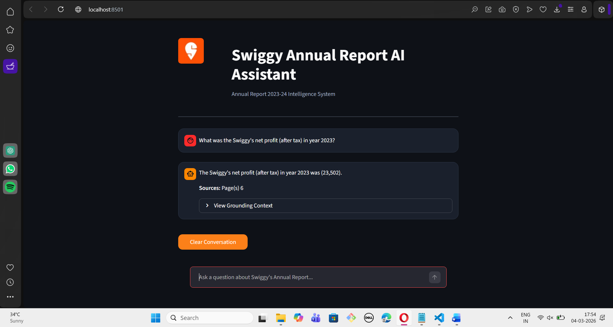

# Swiggy Intelligence Bot 
### AI-Powered Annual Report Analysis System

This repository contains a **Retrieval-Augmented Generation (RAG)** application designed to analyze and answer queries based on the **Swiggy Annual Report 2023-24**. Developed as a technical assignment for the **Newel Technology** ML Intern recruitment.

---

## 🎯 Project Objective
An advanced AI system built to accurately answer user questions based strictly on the Swiggy Annual Report 2023-24. This project implements a sophisticated Retrieval-Augmented Generation (RAG) pipeline designed to prevent hallucinations and provide context-grounded financial insights.

The objective of this system is to allow users to ask natural language questions regarding Swiggy's business operations and receive accurate answers derived solely from the official document.




## 🛠️ Tech Stack
* **LLM:** Llama-3.2-3B-Instruct (via Hugging Face)
* **Orchestration:** LangChain
* **Vector Database:** ChromaDB
* **Embeddings:** `sentence-transformers/all-MiniLM-L6-v2`
* **UI Framework:** Streamlit
* **Document Parsing:** PyPDF with Recursive Character Splitting

---

## System Architecture 


## 🛠️ How it Works
1.  [cite_start]**Ingestion:** The Swiggy Annual Report PDF is loaded and cleaned[cite: 14].
2.  [cite_start]**Chunking:** Text is broken into 1000-character segments with 200-character overlap to preserve context[cite: 15, 16].
3.  [cite_start]**Indexing:** Chunks are converted to vectors and stored locally in ChromaDB[cite: 17, 18, 19].
4.  [cite_start]**Retrieval:** User queries trigger a multi-query expansion and semantic search.
5.  [cite_start]**Re-ranking:** The most relevant chunks are verified by a Cross-Encoder.
6.  [cite_start]**Generation:** The `Llama-3.2-3B` model synthesizes the final answer using *only* the verified chunks[cite: 22, 23, 28].


## ✅ Assignment Requirement Fulfillment
- [x] [cite_start]**Document Processing:** Implemented `PyPDFLoader` with `RecursiveCharacterTextSplitter` (Chunk size: 1000, Overlap: 200)[cite: 13, 15, 16].
- [x] [cite_start]**Embedding & Vector Store:** Generated embeddings using `all-MiniLM-L6-v2` and stored in a persistent `ChromaDB` instance[cite: 18, 19].
- [x] [cite_start]**Strict RAG Logic:** Engineered a "Context-Only" prompt to ensure zero hallucinations[cite: 11, 23].
- [x] [cite_start]**User Interface:** Developed a Streamlit UI displaying the Final Answer and Supporting Context[cite: 25, 28, 29].

## 🚀 Key Features Implemented
To ensure the highest accuracy for financial data, this system goes beyond basic similarity search:
* [cite_start]**Multi-Query Retrieval:** Uses the LLM to paraphrase the user query into 3 variations, overcoming keyword-matching limitations in financial terminology.
* [cite_start]**Re-ranking (Cross-Encoder):** Uses `ms-marco-MiniLM-L-6-v2` to re-evaluate the top 5 retrieved chunks, selecting only the top 3 most relevant context snippets for the LLM.

---

## 📂 Project Structure
```text
Swiggy_Intelligence_Bot/
├── assets/             # Project images 
├── data/               # Source PDF (Swiggy Annual Report)
├── model_evaluation/        # Automated Ragas performance reports (CSV)
├── src/
│   ├── rag_pipeline.py # Core RAG logic (Chunking, Embedding, Generation)
│   └── app.py          # Streamlit Interactive UI
|   └── evaluation_rag.py    # Automated Evaluation Harness
├── testing/
|   ├── test_backend.py # Backend validation 
├── .env                # API Keys
└── requirements.txt    # Dependency list
```


---
## 🔗 Data Source
Document: [Swiggy Annual Report FY 2023-24](https://drive.google.com/file/d/1yTooHqnyEzU1pI5fd6iK3VhRGMjpfAgc/view?usp=sharing)

---

## 📊 Evaluation Metrics
The system was evaluated using the **RAGAS framework**.
These results indicate that the generated responses remain highly grounded in the retrieved context while maintaining strong query relevance.
```text
| Metric           | Score |
|------------------|-------|
| Faithfulness     | 1.00  |
| Answer Relevancy | 0.89  |
```
---

## ⚙️ Setup and Installation
1. Clone the Repository:
```bash
git clone https://github.com/Aastha2675/RAG-Based_Questionary_answering_system.git
cd RAG-Based_Questionary_answering_system
```

2. Environment Setup:
Create a .env file in the root
```bash
HUGGINGFACE_API_KEY=your_huggingface_api_token
```

3. Run the Application:
```bash
streamlit run src/app.py
```

4. Run Evaluation:
```bash
python src/evaluate_rag.py
```

---

## 👤 Author
Aastha Mhatre 